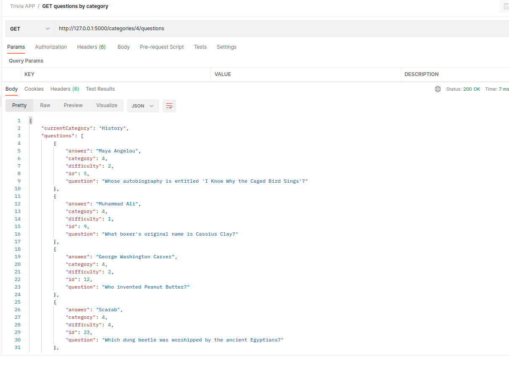
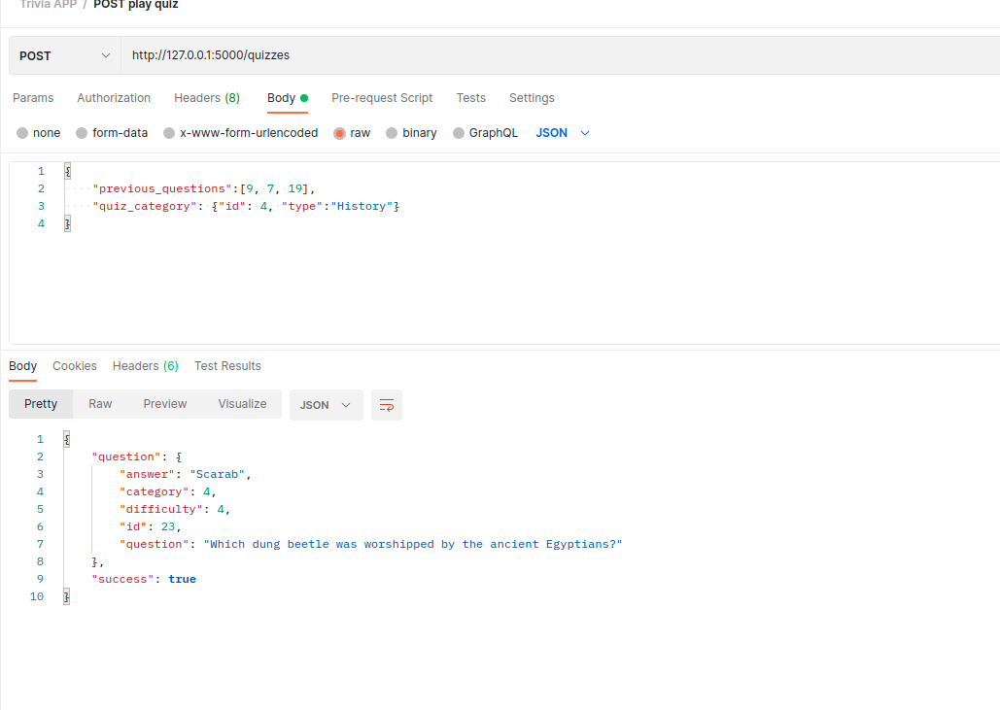

# API Development and Documentation Final Project

## Trivia App

Udacity is invested in creating bonding experiences for its employees and students. A bunch of team members got the idea to hold trivia on a regular basis and created a webpage to manage the trivia app and play the game, but their API experience is limited and still needs to be built out.

That's where you come in! Help them finish the trivia app so they can start holding trivia and seeing who's the most knowledgeable of the bunch. The application must:

1. Display questions - both all questions and by category. Questions should show the question, category and difficulty rating by default and can show/hide the answer.
2. Delete questions.
3. Add questions and require that they include question and answer text.
4. Search for questions based on a text query string.
5. Play the quiz game, randomizing either all questions or within a specific category.

Completing this trivia app will give you the ability to structure plan, implement, and test an API - skills essential for enabling your future applications to communicate with others.

## Getting Started

You can have acces to the project files by [Forking](https://help.github.com/en/articles/fork-a-repo) the [project repository](https://github.com/Elcid-Chawa/cd0037-API-Development-and-Documentation-project) and [clone](https://help.github.com/en/articles/cloning-a-repository) your forked repository to your machine. You will run the project locally on your system.

### Pre-requisit and Local Developement
- Make sure you have a posgresql server running in your machine on port 5432
- Have python 3.7 or higher installed on your machine and install virtualenv with the command
```
pip install virtualenv
```
- install node 12.13 or higher


### Backend

The [backend](./backend/README.md) directory contains the files to run the API using the falsk server. 

- To run the backend:
     - create a virtualenv with python 3.7 and activate it
     ```
     virtualenv venv --python=3.7
     source venv/bin/activate
     ```
     - navigate to the backend directory (if you are stil in the root directory) and install the project dependencies
    ```
    cd ./backend
    pip install -r requrements.txt
    ```
    - The file where endpoints are defined is found in  `backend/flaskr/__init__.py`

> View the [Backend README](./backend/README.md) for more details in running and testing the backend.

### Frontend

The [frontend](./frontend/README.md) directory contains a complete React frontend to consume the data from the Flask server. 
- To run the frontend:
    - navigate to the frontend directory
    - install the node dependencies
    ```
    npm i
    ```
    - start the frontend application
    ```
    npm start
    ```

- Sample: http://localhost:3000


> View the [Frontend README](./frontend/README.md) for more details.

## API Reterence

- The base URL for this API is `http://127.0.0.1:5000`, when running the backend locally on your computer.
- The API is open and would not be needing any athentication to access its endpoints

## Enpoints
Below is an illustration of the endpoints for this API and how thwy can be accessed

#### GET /categories 
- General:
    - This endpoint returns all the diferent questions categories from the database
    - It aslo sends a success status of True when it is run success fully
- Sample: http://127.0.01:5000/categories

- results from postman:


#### GET /questions 
- General:
    - This endpoint returns all the questions from the database
    - It aslo sends a success status of True when it is run success fully
    - It also returns a list of categories, total number of questions and current category id
    - This endpoint also supports pagination. It defaults to page 1 at initial run.
- Sample: 
    - http://127.0.01:5000/questions
    - with pagination: http://127.0.0.1:5000/questions?page=2

- results from postman:


#### DELETE /questions/{q_id }
- General:
    - This endpoint is called to delete a question by id
    - It aslo sends a success status of True when it is run success fully
- Sample: http://127.0.01:5000/questions/4

- results from postman:


#### POST /questions
- General:
    - This endpoint is called to create a new questions in the databse
    - It takes a body query in json format and use it to create a question object 
    - body query includes fro example: 
    ```json
        { 
            "question":"the question", 
            "answer":"the answer",
            "difficulty": 1,
            "category": 1
        }
    ```
- Sample: http://127.0.01:5000/questions/4

- results from postman:


#### POST /search
- General:
    - This endpoint searches for a question based on an input string
    - it accepts a body query incldung the search string
    - example:
    ```json
        {
            "searchTerm":"How"
        }
    ```
- Sample: http://127.0.01:5000/search

- results from postman:


#### GET /categories/{cid}/questions
- General:
    - This endpoint is called to get questions based on a certain category
    - It parses the category id as a parameter (`cid`) and returns all questions under that category
- Sample: http://127.0.01:5000/categories/4/questions

- results from postman:



#### POST /quizzes
- General:
    - This endpoint to play the Trvia game
    - It accepts a body query that returns a random questions based on the categroy of previous questions and can also pick a random questions if no previous question or category is found.
- Sample: http://127.0.01:5000/quizzes

- results from postman:



## Error Handling

I case the endpoints fail at any point, there is an error handler that captures the error and prevents the backend from crashing.

- our application handles the errors: 404, 405, 433 and 500

The errors return a json object of the form
```json
    {
        "success"::False,
        "error":404,
        "message": "Error: Resource not foud"
    }

## Deployments
- No dployment exist for this API at the moment

Authors:
- Elcid Chawa

Acknowlegements
- I acknowlege that the boiler plate for this project was designed by Udacity in partial completion of the FullStack Web Developer Nano Degree course.